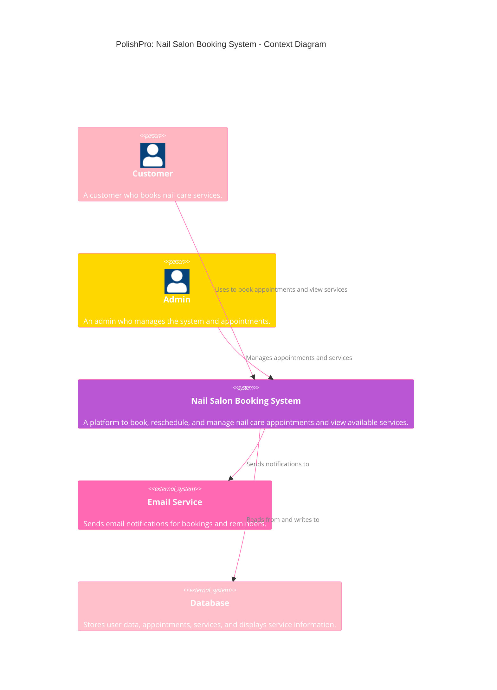
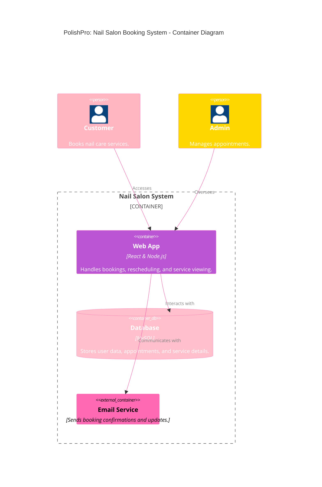
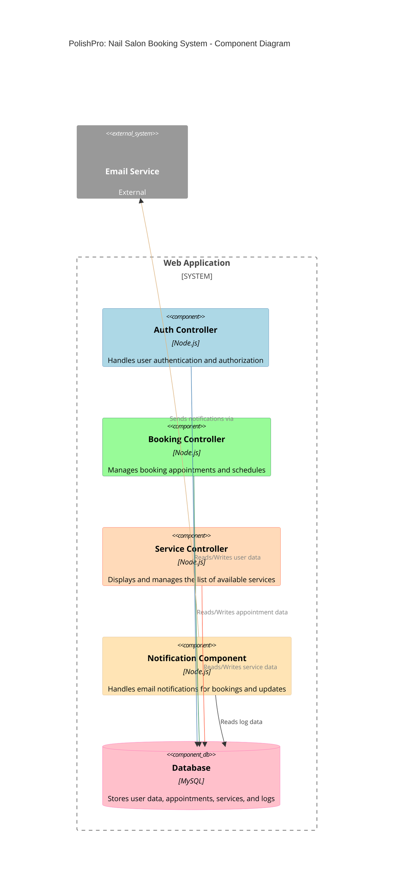
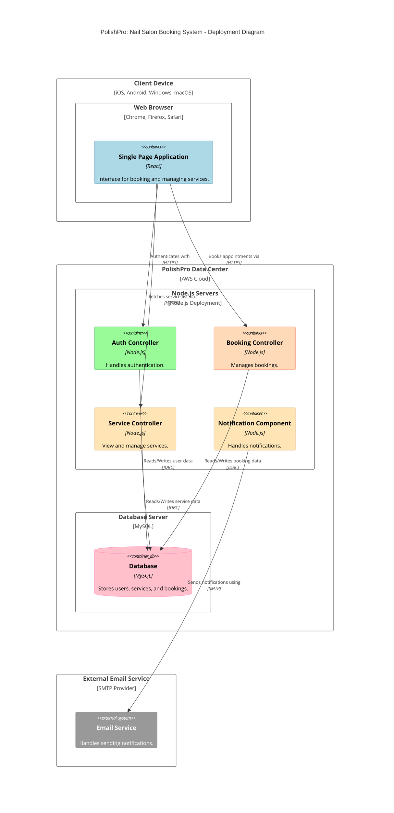

# C4 Architectural Diagrams

## C4 Context Diagram:

```mermaid
C4Context
title PolishPro: Nail Salon Booking System - Context Diagram
Person(customer, "Customer", "A customer who books nail care services.")
Person(admin, "Admin", "An admin who manages the system and appointments.")
System(webApp, "Nail Salon Booking System", "A platform to book, reschedule, and manage nail care appointments and view available services.")
System_Ext(emailService, "Email Service", "Sends email notifications for bookings and reminders.")
System_Ext(database, "Database", "Stores user data, appointments, services, and displays service information.")

Rel(customer, webApp, "Uses to book appointments and view services")
Rel(admin, webApp, "Manages appointments and services")
Rel(webApp, emailService, "Sends notifications to")
Rel(webApp, database, "Reads from and writes to")

UpdateElementStyle(customer, $fontColor="white", $bgColor="#FFB6C1", $borderColor="#FF69B4")
UpdateElementStyle(admin, $fontColor="white", $bgColor="#FFD700", $borderColor="#FF69B4")
UpdateElementStyle(webApp, $fontColor="white", $bgColor="#BA55D3", $borderColor="#FF69B4")
UpdateElementStyle(emailService, $fontColor="white", $bgColor="#FF69B4", $borderColor="#FF69B4")
UpdateElementStyle(database, $fontColor="white", $bgColor="#FFC0CB", $borderColor="#FF69B4")

UpdateRelStyle(customer, webApp, $textColor="grey", $lineColor="#FF69B4", $offsetY="-5")
UpdateRelStyle(admin, webApp, $textColor="grey", $lineColor="#FF69B4", $offsetY="5")
UpdateRelStyle(webApp, emailService, $textColor="grey", $lineColor="#FF69B4", $offsetY="15")
UpdateRelStyle(webApp, database, $textColor="grey", $lineColor="#FF69B4", $offsetY="25")

UpdateLayoutConfig($c4ShapeInRow="2", $c4BoundaryInRow="1")


```
## C4 Container Diagram:

```mermaid
C4Container
title PolishPro: Nail Salon Booking System - Container Diagram

Person(customer, "Customer", "Books nail care services.")
Person(admin, "Admin", "Manages appointments.")

Container_Boundary(salonSys, "Nail Salon System") {
    Container(webApp, "Web App", "React & Node.js", "Handles bookings, rescheduling, and service viewing.")
    ContainerDb(database, "Database", "MySQL", "Stores user data, appointments, and service details.")
    Container_Ext(emailService, "Email Service", "Sends booking confirmations and updates.")
}

Rel(customer, webApp, "Accesses")
Rel(admin, webApp, "Oversees")

Rel(webApp, database, "Interacts with")
Rel(webApp, emailService, "Communicates with")

UpdateElementStyle(customer, $fontColor="white", $bgColor="#FFB6C1", $borderColor="#FF69B4")
UpdateElementStyle(admin, $fontColor="white", $bgColor="#FFD700", $borderColor="#FF69B4")
UpdateElementStyle(webApp, $fontColor="white", $bgColor="#BA55D3", $borderColor="#FF69B4")
UpdateElementStyle(emailService, $fontColor="black", $bgColor="#FF69B4", $borderColor="#FF69B4")
UpdateElementStyle(database, $fontColor="white", $bgColor="#FFC0CB", $borderColor="#FF69B4")

UpdateRelStyle(customer, webApp, $textColor="grey", $lineColor="#FF69B4", $offsetY="-5")
UpdateRelStyle(admin, webApp, $textColor="grey", $lineColor="#FF69B4", $offsetY="5")
UpdateRelStyle(webApp, emailService, $textColor="grey", $lineColor="#FF69B4", $offsetY="15")
UpdateRelStyle(webApp, database, $textColor="grey", $lineColor="#FF69B4", $offsetY="25")

UpdateLayoutConfig($c4ShapeInRow="2", $c4BoundaryInRow="1")

```
## C4 Compontent Diagram:

```mermaid
C4Component
title PolishPro: Nail Salon Booking System - Component Diagram

System_Boundary(c1, "Web Application") {
    Component(authController, "Auth Controller", "Node.js", "Handles user authentication and authorization")
    Component(bookingController, "Booking Controller", "Node.js", "Manages booking appointments and schedules")
    Component(serviceController, "Service Controller", "Node.js", "Displays and manages the list of available services")
    Component(notificationComponent, "Notification Component", "Node.js", "Handles email notifications for bookings and updates")
    ComponentDb(database, "Database", "MySQL", "Stores user data, appointments, services, and logs")
}

System_Ext(emailService, "Email Service", "External", "Sends email notifications for bookings and updates")

Rel(authController, database, "Reads/Writes user data")
Rel(bookingController, database, "Reads/Writes appointment data")
Rel(serviceController, database, "Reads/Writes service data")
Rel(notificationComponent, emailService, "Sends notifications via")
Rel(notificationComponent, database, "Reads log data")

UpdateElementStyle(authController, $fontColor="black", $bgColor="#ADD8E6", $borderColor="#4682B4")
UpdateElementStyle(bookingController, $fontColor="black", $bgColor="#98FB98", $borderColor="#2E8B57")
UpdateElementStyle(serviceController, $fontColor="black", $bgColor="#FFDAB9", $borderColor="#FF6347")
UpdateElementStyle(notificationComponent, $fontColor="black", $bgColor="#FFE4B5", $borderColor="#DEB887")
UpdateElementStyle(database, $fontColor="black", $bgColor="#FFC0CB", $borderColor="#FF69B4")

UpdateRelStyle(authController, database, $textColor="grey", $lineColor="#4682B4")
UpdateRelStyle(bookingController, database, $textColor="grey", $lineColor="#2E8B57")
UpdateRelStyle(serviceController, database, $textColor="grey", $lineColor="#FF6347")
UpdateRelStyle(notificationComponent, emailService, $textColor="grey", $lineColor="#DEB887")

```

## C4 Deployment Diagram:

```mermaid
C4Deployment
title PolishPro: Nail Salon Booking System - Deployment Diagram

Deployment_Node(clientDevice, "Client Device", "iOS, Android, Windows, macOS") {
    Deployment_Node(webBrowser, "Web Browser", "Chrome, Firefox, Safari") {
        Container(spa, "Single Page Application", "React", "Interface for booking and managing services.")
    }
}

Deployment_Node(dataCenter, "PolishPro Data Center", "AWS Cloud") {
    Deployment_Node(serverCluster, "Node.js Servers", "Node.js Deployment") {
        Container(authController, "Auth Controller", "Node.js", "Handles authentication.")
        Container(bookingController, "Booking Controller", "Node.js", "Manages bookings.")
        Container(serviceController, "Service Controller", "Node.js", "View and manage services.")
        Container(notificationComponent, "Notification Component", "Node.js", "Handles notifications.")
    }
    
    Deployment_Node(dbServer, "Database Server", "MySQL") {
        ContainerDb(database, "Database", "MySQL", "Stores users, services, and bookings.")
    }
}

Deployment_Node(externalService, "External Email Service", "SMTP Provider") {
    System_Ext(emailService, "Email Service", "Handles sending notifications.")
}

Rel(spa, authController, "Authenticates with", "HTTPS")
Rel(spa, bookingController, "Books appointments via", "HTTPS")
Rel(spa, serviceController, "Fetches service list via", "HTTPS")
Rel(notificationComponent, emailService, "Sends notifications using", "SMTP")
Rel(authController, database, "Reads/Writes user data", "JDBC")
Rel(bookingController, database, "Reads/Writes booking data", "JDBC")
Rel(serviceController, database, "Reads/Writes service data", "JDBC")

UpdateElementStyle(spa, $fontColor="black", $bgColor="#ADD8E6", $borderColor="#4682B4")
UpdateElementStyle(authController, $fontColor="black", $bgColor="#98FB98", $borderColor="#2E8B57")
UpdateElementStyle(bookingController, $fontColor="black", $bgColor="#FFDAB9", $borderColor="#FF6347")
UpdateElementStyle(serviceController, $fontColor="black", $bgColor="#FFE4B5", $borderColor="#DEB887")
UpdateElementStyle(notificationComponent, $fontColor="black", $bgColor="#FFE4B5", $borderColor="#DEB887")
UpdateElementStyle(database, $fontColor="black", $bgColor="#FFC0CB", $borderColor="#FF69B4")

UpdateLayoutConfig($c4ShapeInRow="2", $c4BoundaryInRow="1")
```
