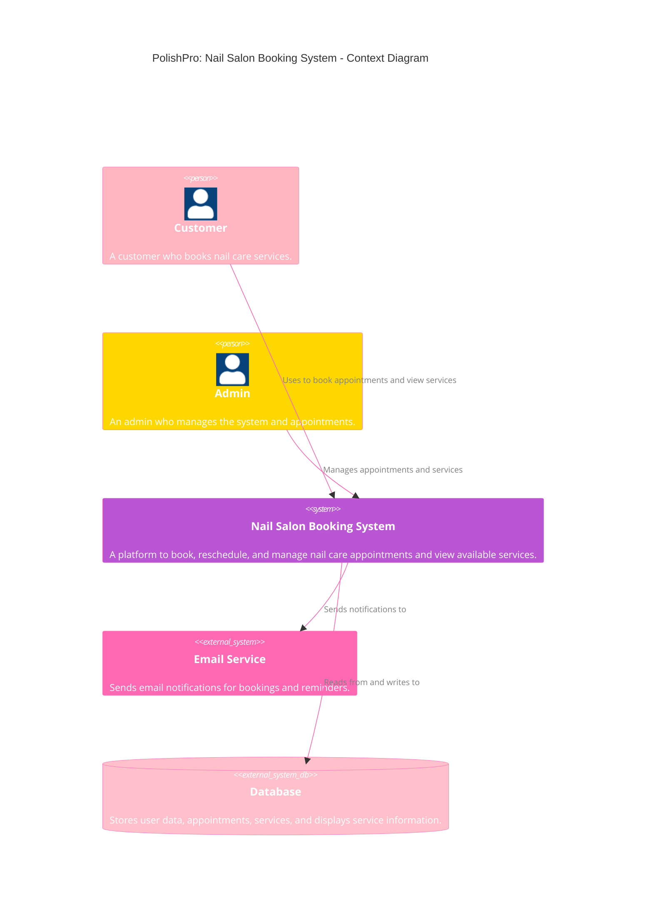
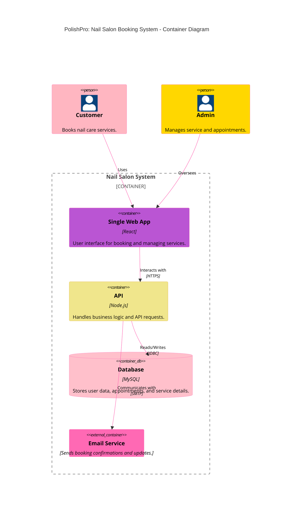
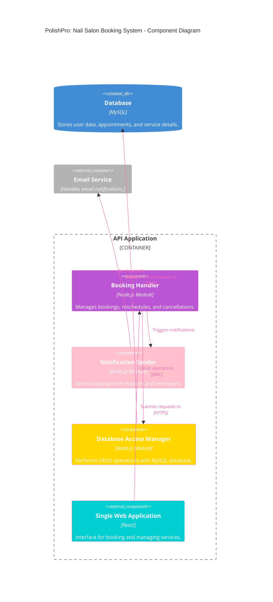
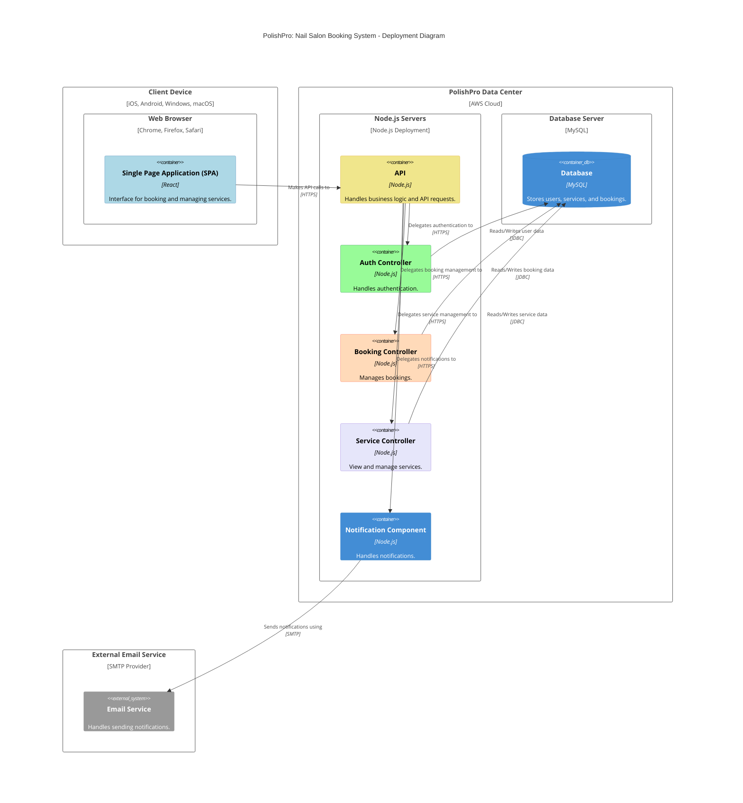

# C4 Architectural Diagrams

## C4 Context Diagram:
This diagram provides a high-level view of the PolishPro System, showcasing its interactions with external entities like customers, admins, and third-party services such as an email service and a database.

## C4 Container Diagram:
This diagram details the PolishPro system's structural containers, including the Web App, API, and Database, and how they interact with external services like the Email Service and roles like Customer and Admin.

## C4 Compontent Diagram:
This diagram breaks down the API Application into smaller components such as the Booking Handler, Notification Sender, and Database Access Manager, detailing their interactions and roles within the system.

## C4 Deployment Diagram:
C4 Deployment Diagram provides a comprehensive view of the infrastructure and environment where the PolishPro Nail Salon Booking System is deployed. It illustrates how the system components are distributed across different environments, including client devices, data centers, and external services.

