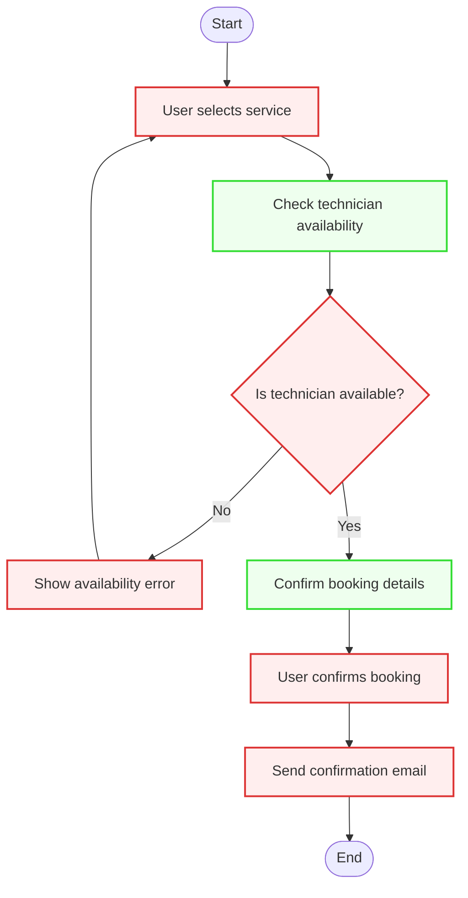
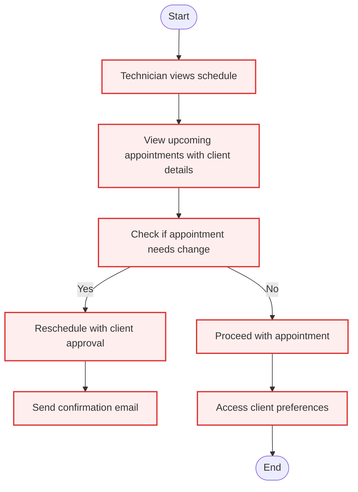
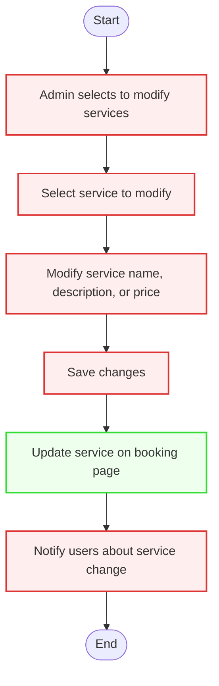

# Activity Diagrams

This document presents Activity Diagrams for key workflows in the **PolishPro: Nail Salon Booking System**. These diagrams visualize critical processes such as **User Registration**, **Appointment Booking**, and **Email Notifications**, aligning with the system's functional requirements. 
The following workflows are covered:

1. **User Registration, Login, and Password Reset**
2. **User Role-Based Login & Access Control**
3. **Appointment Booking**
4. **Appointment Rescheduling or Cancellation**
5. **Client Management by Nail Technicians**
6. **Service Management by Salon Owner/Admin**
7. **Client Preferences Management**
8. **Email Notifications**

Each diagram includes **start/end nodes**, **actions**, **decisions**, and **parallel actions** with **swimlanes** to indicate roles/actors responsible for each step. Markdown explanations describe how these workflows address stakeholder concerns, ensuring the system is secure, efficient, and user-friendly.


# 1.  User Registration, Login, and Password Reset


## 📝 Explanation
- **Covers:** Account creation, strong password enforcement, email verification, login attempts, and password reset via email.
- **Stakeholder Concern:** The system enforces strong passwords, ensures unique email addresses, and provides email verification to ensure security and ease of access for users.
- **System Logic:** The system validates user inputs, sends confirmation emails, handles login attempts, and allows password resets with strong password enforcement.

---

# 2.  User Role-Based Login & Access Control

## 📝 Explanation
- **Covers:** Role recognition and access control (Salon Owner, Nail Technician, Client).
- **Stakeholder Concern:** Ensures that each user has access to appropriate areas of the system based on their role, protecting sensitive data and ensuring a smooth user experience.
- **System Logic:** The system verifies the user's credentials, determines their role, and redirects them to the corresponding dashboard.

---
# 3. Appointment Booking

## 📝 Explanation
- **Covers:** Service selection, technician availability check, booking confirmation, real-time updates, and double-booking prevention.
- **Stakeholder Concern:** Ensures clients can easily book available services while preventing double-booking and keeping clients informed with confirmation emails.
- **System Logic:** The system checks technician availability, confirms booking details with the user, and sends a confirmation email upon successful booking.

---

# 4. Appointment Rescheduling or Cancellation

## 📝 Explanation
- **Covers:** 24-hour cancellation policy enforcement, availability checks for rescheduling, confirmation prompts, and email notifications.
- **Stakeholder Concern:** Ensures appointments are rescheduled or canceled within policy limits, and that clients receive email confirmation for any changes made.
- **System Logic:** The system checks for policy compliance, verifies technician availability for rescheduling, and sends confirmation emails after successful rescheduling or cancellation.

---

## 5. Client Management by Nail Technicians

## 📝 Explanation
- **Covers:** Real-time schedule view, alerts for changes, ability to reschedule with client approval, and access to preferences.
- **Stakeholder Concern:** Nail technicians can efficiently manage their appointments, update schedules with client approval, and access client preferences for improved service delivery.
- **System Logic:** The system provides a schedule view, allows for rescheduling with client approval, and displays client preferences for the technician.

---
## 6. Service Management by Salon Owner/Admin

## 📝 Explanation
- **Covers:** Modify service name, description, price, duration, technician assignment, and real-time reflection on the booking page.
- **Stakeholder Concern:** Salon owners/admins can easily manage services, ensuring updates are reflected immediately for users and technicians.
- **System Logic:** The system allows admins to modify services, update them in real-time on the booking page, and notify users about any changes.

---

## 7. Client Preferences Management
```mermaid
flowchart TD
    Start([Start]) --> A[Client books an appointment]
    A --> B[Save client preferences]
    B --> C[Technician views client preferences]
    C --> D{Does technician update preferences?}
    D -- Yes --> E[Save updated preferences]
    D -- No --> F[End]
    E --> F
    F --> End([End])

    classDef user fill:#FFEEEE,stroke:#D33,stroke-width:2px;
    classDef system fill:#EEFFEE,stroke:#3D3,stroke-width:2px;

    class A,B,C,D,E,F user;
    class F system;

 ```
## 📝 Explanation
- **Covers:** Saving preferences during booking, updating after appointments, and visibility for technicians.
- **Stakeholder Concern:** Ensures client preferences are captured, updated, and accessible for technicians to provide a personalized service.
- **System Logic:** The system saves client preferences during the booking process, displays them to the technician, and allows updates after appointments.
---

## 8.  Email Notifications

```mermaid
flowchart TD
    Start([Start]) --> A[Booking or modification occurs]
    A --> B{Is action successful?}
    B -- Yes --> C[Send success email notification]
    C --> End([End])
    B -- No --> D[Send failure notification to IT admin]
    D --> End

    classDef user fill:#FFEEEE,stroke:#D33,stroke-width:2px;
    classDef system fill:#EEFFEE,stroke:#3D3,stroke-width:2px;

    class A,C user;
    class B,D system;
```

  ## 📝 Explanation
  ### Email Notifications
- **Covers:** Success/failure notifications for booking, rescheduling, cancellation, reminders, and failure logs to IT Admin.
- **Stakeholder Concern:** Ensures that both clients and administrators are notified of important actions, ensuring transparency and communication.
- **System Logic:** The system sends notifications based on the outcome of booking or modification actions, and logs failures to the IT admin for further investigation.


