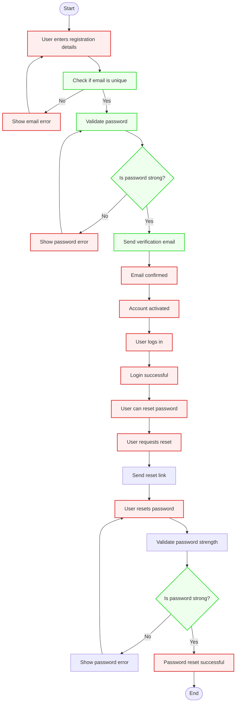
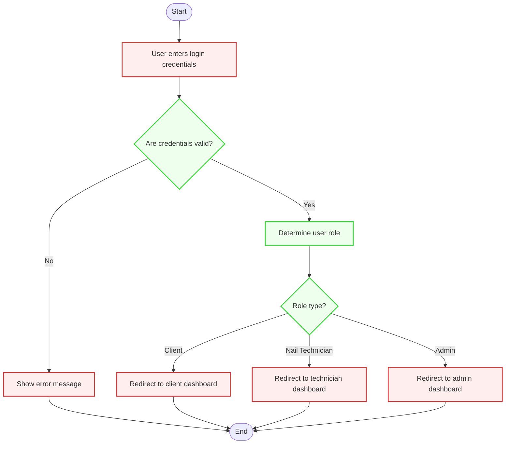
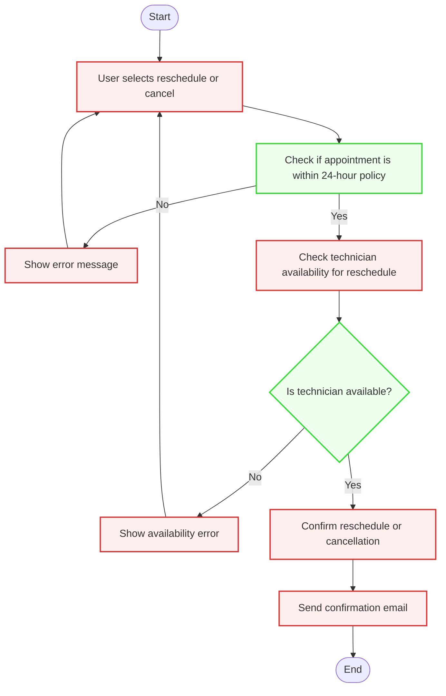
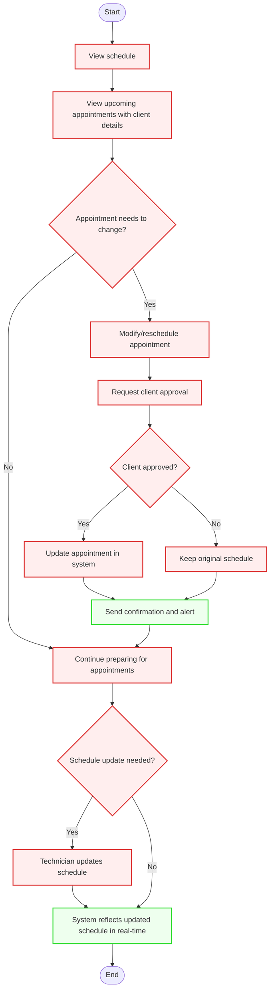

# Activity Diagrams

This document presents Activity Diagrams for key workflows in the **PolishPro: Nail Salon Booking System**. These diagrams visualize critical processes such as **User Registration**, **Appointment Booking**, and **Email Notifications**, aligning with the system's functional requirements. 
The following workflows are covered:

1. **User Registration, Login, and Password Reset**
2. **User Role-Based Login & Access Control**
3. **Appointment Booking**
4. **Appointment Rescheduling or Cancellation**
5. **Client Management by Nail Technicians**
6. **Service Management by Salon Owner/Admin**
7. **Client Preferences Management**
8. **Email Notifications**

Each diagram includes **start/end nodes**, **actions**, **decisions**, and **parallel actions** with **swimlanes** to indicate roles/actors responsible for each step. Markdown explanations describe how these workflows address stakeholder concerns, ensuring the system is secure, efficient, and user-friendly.


# 1.  User Registration, Login, and Password Reset



---

# 2.  User Role-Based Login & Access Control


---
# 3. Appointment Booking


---

# 4. Appointment Rescheduling or Cancellation

---

## 5. Client Management by Nail Technicians


---
## 6. Service Management by Salon Owner/Admin

---

## 7. Client Preferences Management
```mermaid
flowchart TD
    Start([Start]) --> A[Client books an appointment]
    A --> B[Save client preferences]
    B --> C[Technician views client preferences]
    C --> D{Does technician update preferences?}
    D -- Yes --> E[Save updated preferences]
    D -- No --> F[End]
    E --> F
    F --> End([End])

    classDef user fill:#FFEEEE,stroke:#D33,stroke-width:2px;
    classDef system fill:#EEFFEE,stroke:#3D3,stroke-width:2px;

    class A,B,C,D,E,F user;
    class F system;

 ```
---

## 8.  Email Notifications

```mermaid
flowchart TD
    Start([Start]) --> A[Booking or modification occurs]
    A --> B{Is action successful?}
    B -- Yes --> C[Send success email notification]
    C --> End([End])
    B -- No --> D[Send failure notification to IT admin]
    D --> End

    classDef user fill:#FFEEEE,stroke:#D33,stroke-width:2px;
    classDef system fill:#EEFFEE,stroke:#3D3,stroke-width:2px;

    class A,C user;
    class B,D system;
```
