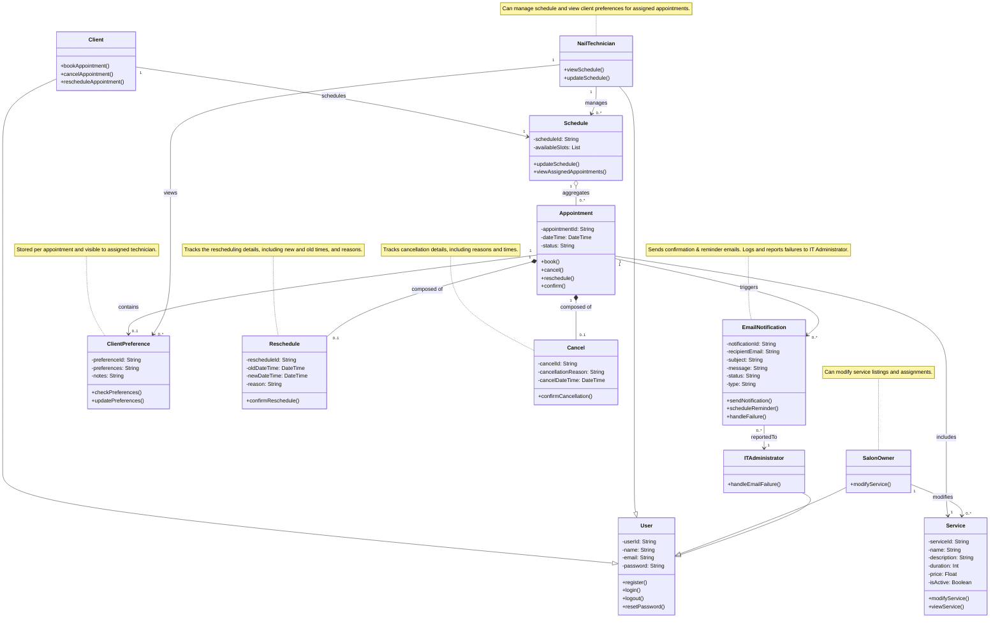

# Update Classs Diagram 
Updated class diagram showing repository interfaces and implementations.

```mermaid
classDiagram
    %% ========= GENERIC REPOSITORY INTERFACE ========= %%
    class Repository~T, ID~ {
        + save(entity: T)
        + findById(id: ID) Optional~T~
        + findAll() List~T~
        + delete(id: ID)
    }

    %% ========= ENTITIES ========= %%
    class User {
        - userId: String
        - name: String
        - email: String
        - password: String
        + register()
        + login()
        + logout()
        + resetPassword()
    }
    class Client {
        + bookAppointment()
        + cancelAppointment()
        + rescheduleAppointment()
    }
    class NailTechnician {
        + viewSchedule()
        + updateSchedule()
    }
    class SalonOwner {
        + modifyService()
    }
    class ITAdministrator {
        + handleEmailFailure()
    }
    class Appointment {
        - appointmentId: String
        - dateTime: DateTime
        - status: String
        + book()
        + cancel()
        + reschedule()
        + confirm()
    }
    class Service {
        - serviceId: String
        - name: String
        - description: String
        - duration: Int
        - price: Float
        - isActive: Boolean
        + modifyService()
        + viewService()
    }
    class Schedule {
        - scheduleId: String
        - availableSlots: List<DateTime>
        + updateSchedule()
        + viewAssignedAppointments()
    }
    class EmailNotification {
        - notificationId: String
        - recipientEmail: String
        - subject: String
        - message: String
        - status: String
        - type: String
        + sendNotification()
        + scheduleReminder()
        + handleFailure()
    }
    class ClientPreference {
        - preferenceId: String
        - preferences: String
        - notes: String
        + checkPreferences()
        + updatePreferences()
    }
    class Reschedule {
        - rescheduleId: String
        - oldDateTime: DateTime
        - newDateTime: DateTime
        - reason: String
        + confirmReschedule()
    }
    class Cancel {
        - cancelId: String
        - cancellationReason: String
        - cancelDateTime: DateTime
        + confirmCancellation()
    }

    %% ========= REPOSITORY INTERFACES ========= %%
    class UserRepository { <<interface>> }
    class ClientRepository { <<interface>> }
    class NailTechnicianRepository { <<interface>> }
    class SalonOwnerRepository { <<interface>> }
    class ITAdministratorRepository { <<interface>> }
    class AppointmentRepository { <<interface>> }
    class ServiceRepository { <<interface>> }
    class ScheduleRepository { <<interface>> }
    class EmailNotificationRepository { <<interface>> }
    class ClientPreferenceRepository { <<interface>> }
    class RescheduleRepository { <<interface>> }
    class CancelRepository { <<interface>> }

    %% ========= IN-MEMORY REPOSITORY IMPLEMENTATIONS ========= %%
    class InMemoryUserRepository
    class InMemoryClientRepository
    class InMemoryNailTechnicianRepository
    class InMemorySalonOwnerRepository
    class InMemoryITAdministratorRepository
    class InMemoryAppointmentRepository
    class InMemoryServiceRepository
    class InMemoryScheduleRepository
    class InMemoryEmailNotificationRepository
    class InMemoryClientPreferenceRepository
    class InMemoryRescheduleRepository
    class InMemoryCancelRepository

    %% ========= FILESYSTEM REPOSITORY IMPLEMENTATIONS ========= %%
    class FileSystemUserRepository
    class FileSystemClientRepository
    class FileSystemNailTechnicianRepository
    class FileSystemSalonOwnerRepository
    class FileSystemITAdministratorRepository
    class FileSystemAppointmentRepository
    class FileSystemServiceRepository
    class FileSystemScheduleRepository
    class FileSystemEmailNotificationRepository
    class FileSystemClientPreferenceRepository
    class FileSystemRescheduleRepository
    class FileSystemCancelRepository

    %% ========= IMPLEMENTATION RELATIONSHIPS ========= %%
    Repository <|.. UserRepository
    Repository <|.. ClientRepository
    Repository <|.. NailTechnicianRepository
    Repository <|.. SalonOwnerRepository
    Repository <|.. ITAdministratorRepository
    Repository <|.. AppointmentRepository
    Repository <|.. ServiceRepository
    Repository <|.. ScheduleRepository
    Repository <|.. EmailNotificationRepository
    Repository <|.. ClientPreferenceRepository
    Repository <|.. RescheduleRepository
    Repository <|.. CancelRepository

    InMemoryUserRepository ..|> UserRepository
    FileSystemUserRepository ..|> UserRepository

    InMemoryClientRepository ..|> ClientRepository
    FileSystemClientRepository ..|> ClientRepository

    InMemoryNailTechnicianRepository ..|> NailTechnicianRepository
    FileSystemNailTechnicianRepository ..|> NailTechnicianRepository

    InMemorySalonOwnerRepository ..|> SalonOwnerRepository
    FileSystemSalonOwnerRepository ..|> SalonOwnerRepository

    InMemoryITAdministratorRepository ..|> ITAdministratorRepository
    FileSystemITAdministratorRepository ..|> ITAdministratorRepository

    InMemoryAppointmentRepository ..|> AppointmentRepository
    FileSystemAppointmentRepository ..|> AppointmentRepository

    InMemoryServiceRepository ..|> ServiceRepository
    FileSystemServiceRepository ..|> ServiceRepository

    InMemoryScheduleRepository ..|> ScheduleRepository
    FileSystemScheduleRepository ..|> ScheduleRepository

    InMemoryEmailNotificationRepository ..|> EmailNotificationRepository
    FileSystemEmailNotificationRepository ..|> EmailNotificationRepository

    InMemoryClientPreferenceRepository ..|> ClientPreferenceRepository
    FileSystemClientPreferenceRepository ..|> ClientPreferenceRepository

    InMemoryRescheduleRepository ..|> RescheduleRepository
    FileSystemRescheduleRepository ..|> RescheduleRepository

    InMemoryCancelRepository ..|> CancelRepository
    FileSystemCancelRepository ..|> CancelRepository

    %% ========= ENTITY INHERITANCE ========= %%
    Client --|> User
    NailTechnician --|> User
    SalonOwner --|> User
    ITAdministrator --|> User

    %% ========= DOMAIN RELATIONSHIPS ========= %%
    Client "1" --> "1" Schedule : schedules
    NailTechnician "1" --> "0..*" Schedule : manages
    Schedule "1" o-- "0..*" Appointment : aggregates
    Appointment "1" --> "1" Service : includes
    Appointment "1" --> "0..*" EmailNotification : triggers
    Appointment "1" --> "0..1" ClientPreference : contains
    Appointment "1" *-- "0..1" Reschedule : composed of
    Appointment "1" *-- "0..1" Cancel : composed of
    EmailNotification "0..*" --> "1" ITAdministrator : reportedTo
    NailTechnician "1" --> "0..*" ClientPreference : views
    SalonOwner "1" --> "0..*" Service : modifies

```

---
# Class Diagram for PolishPro: Nail Salon Booking System

This class diagram illustrates the key components and relationships of the **PolishPro Nail Salon Booking System**. It captures the interactions between users, appointments, services, and notifications, as well as the responsibilities of each class within the system.

# Key Design Decisions for PolishPro: Nail Salon Booking System

## 1. Inheritance Structure for User Roles
- The `User` class is the base class with common attributes (`userId`, `name`, `email`, `password`) and authentication methods.
- Specialized roles (`Client`, `NailTechnician`, `SalonOwner`, `ITAdministrator`) inherit from `User`, allowing role-based access to functionalities while promoting **code reusability and maintainability**.

## 2. Centralized Appointment Management
- The `Appointment` class manages booking lifecycle operations (`book()`, `cancel()`, `reschedule()`, `confirm()`), centralizing appointment handling.
- It associates directly with:
  - `Service`: each appointment includes a specific service.
  - `ClientPreference`: optional customization for appointments.
  - `Reschedule` & `Cancel`: handled as **compositions**, representing strong ownership and life-cycle dependency.
  - `EmailNotification`: supports communication workflows.

## 3. Role-Specific Responsibilities
- `Client`: can manage their own appointments.
- `NailTechnician`: manages their schedules and accesses client preferences, reflecting operational duties.
- `SalonOwner`: controls the service catalog.
- `ITAdministrator`: handles email delivery failures—decoupling infrastructure responsibilities from the application logic.

## 4. Schedule Management
- `Schedule` is shared between `Client` and `NailTechnician`, allowing technicians to manage and clients to view appointment availability.
- The **aggregation** relationship with `Appointment` indicates that appointments exist independently but are organized within a schedule.

## 5. Notification and Escalation Logic
- `EmailNotification` supports reminders and confirmations with `sendNotification()` and `scheduleReminder()`.
- Errors are escalated to `ITAdministrator`, reinforcing a clear separation between functional operations and technical support.

## 6. Preferences
- `ClientPreference` is designed as a separate class, allowing flexible storage and access of personalized data per appointment.
- Accessible by the assigned technician, this supports a **personalized customer experience**, which is crucial for service businesses.

## 7. Appointment Changes
- `Reschedule` and `Cancel` are modeled as separate classes for clarity, tracking detailed change history (e.g., reasons, timestamps).
- Using **composition** shows that these records are tightly coupled with their respective appointments and do not exist independently.

---

## Design Rationale Summary
- Promotes **modularity**, **role separation**, and **clear responsibilities**.
- Leverages **UML best practices** with proper use of inheritance, aggregation, and composition.
- Addresses both **business needs** (e.g., appointment scheduling, service management) and **technical needs** (e.g., email handling, user access control).

