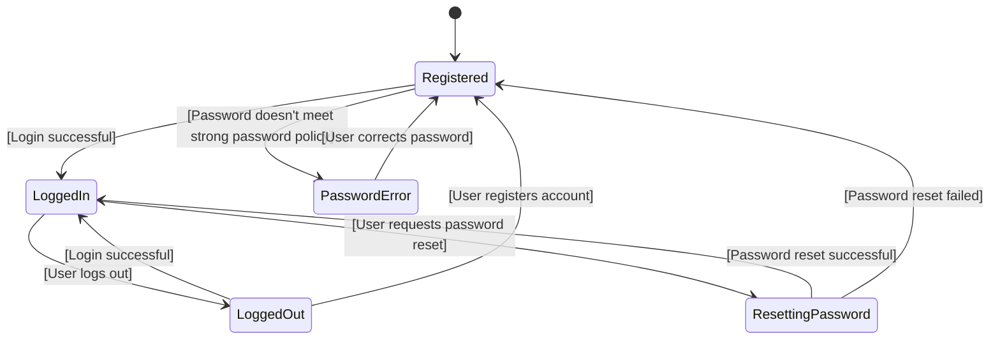
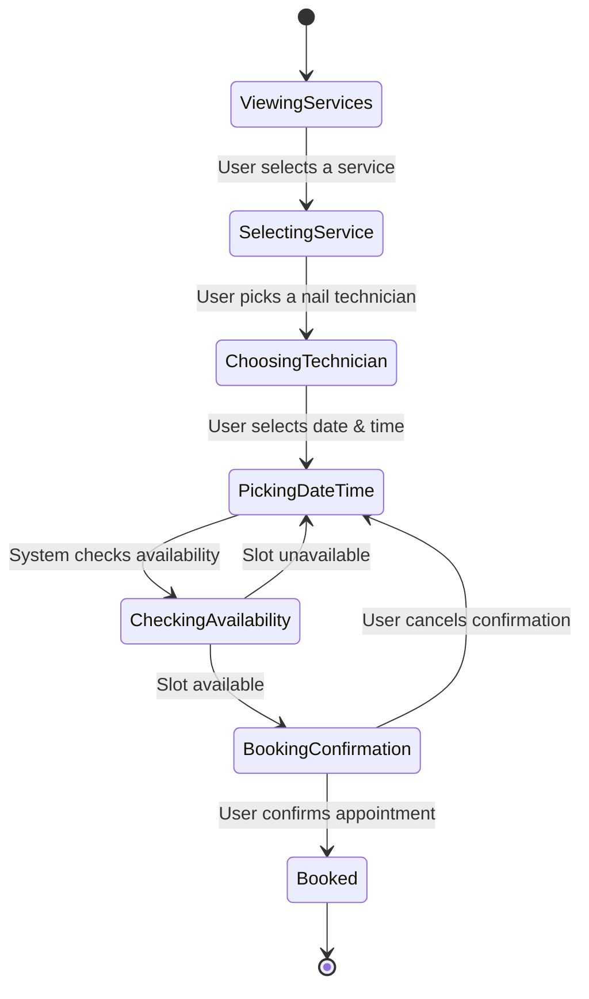
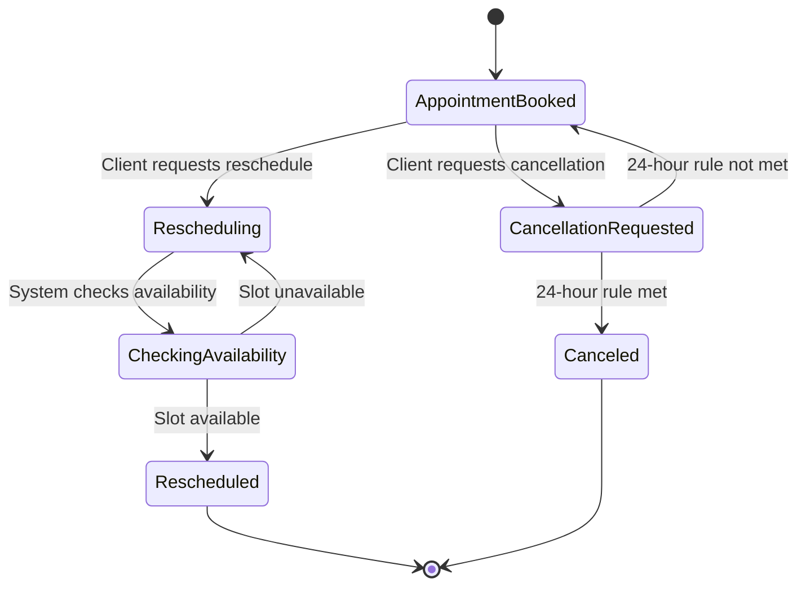
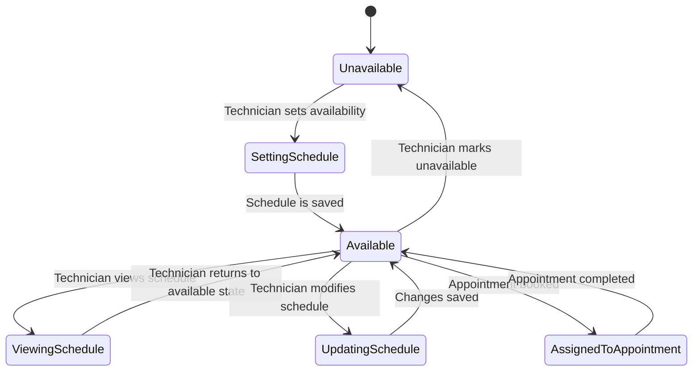
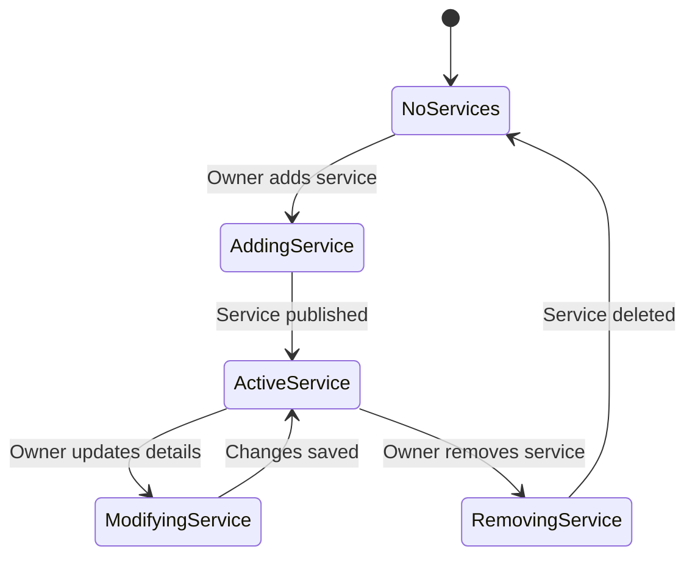
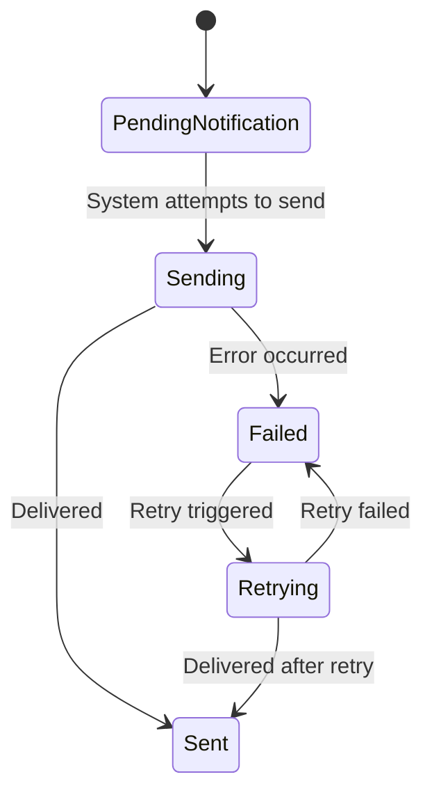
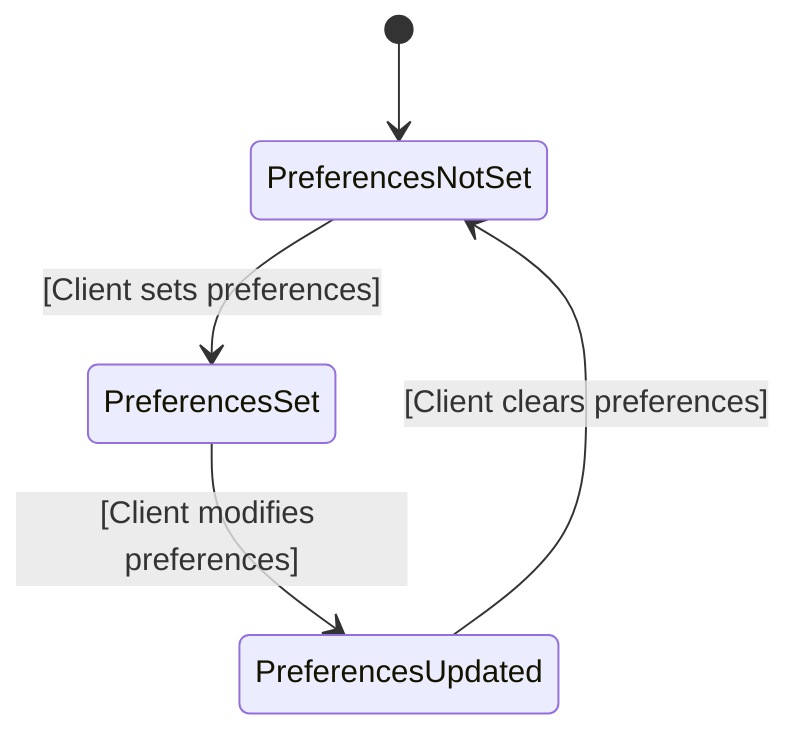

# 📊 Object State Modeling with State Transition Diagrams

This section presents **7 critical objects** in the PolishPro: Nail Salon Booking System, with corresponding **state transition diagrams** created using UML standards in **Mermaid.js**. Each diagram includes:
- States
- Transitions
- Guard conditions (where applicable)

---

## 1. 🧾 User Account
### State Transition Diagram

---

# 2. 📆 Appointment
### State Transition Diagram

---

# 3️. Appointment Rescheduling & Cancellation ❌
### State Transition Diagram

---

## 4️. Technician Schedule Management 📅

### State Transition Diagram

---

## 5️. Service Management ⚙
### State Transition Diagram

---

## 6️. Email Notifications 📩
### State Transition Diagram

  ---

## 7️. Client Preferences 🎯
### State Transition Diagram

---
## Explanation of diagrams 
- [Explanations](https://github.com/demifarquhar01/PolishPro/blob/2e9b097dca5eecf7b775e149e64a8ffc1fad5724/Explanations.md)
