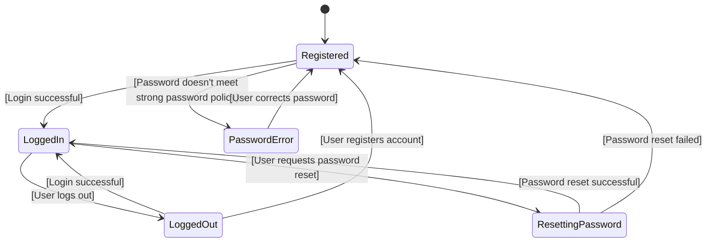
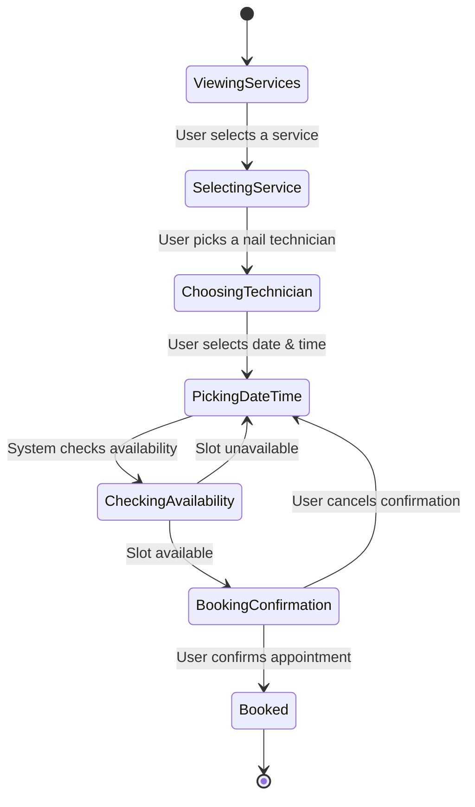
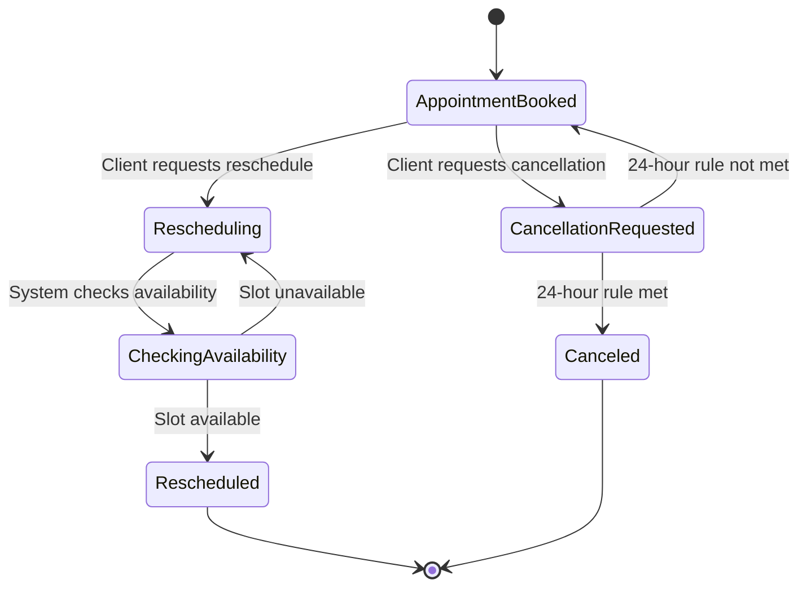
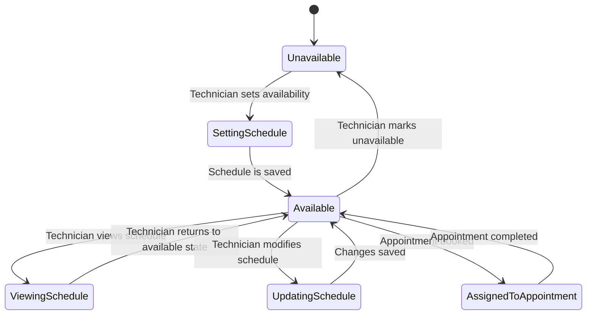
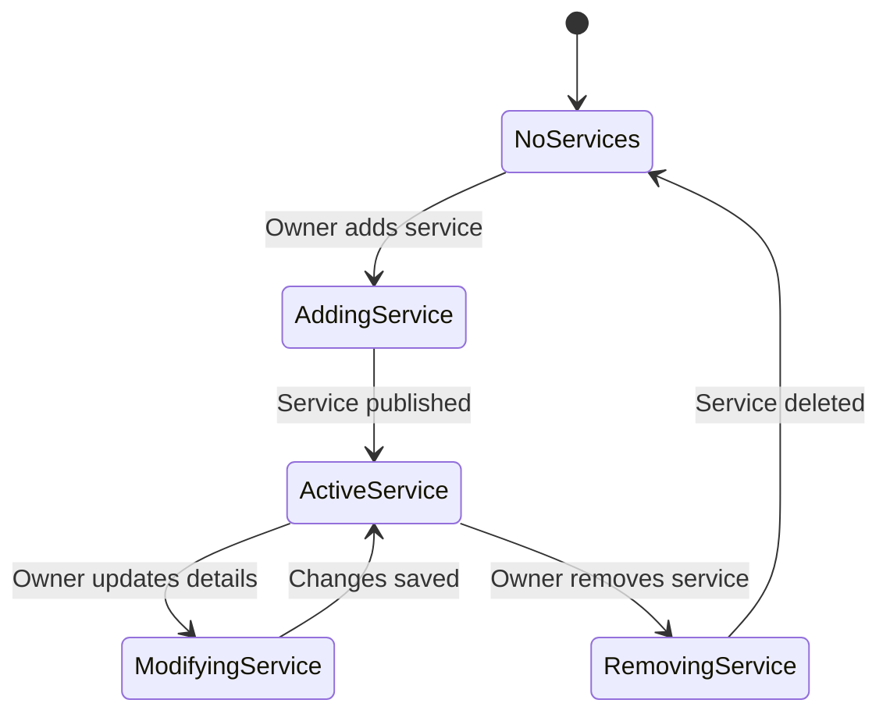
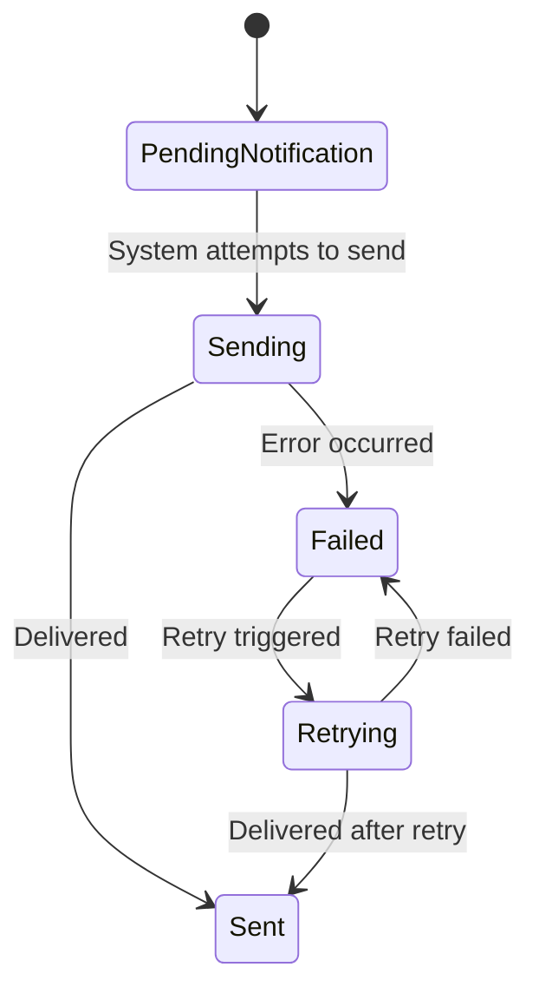
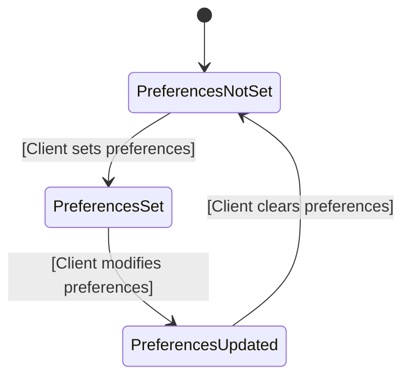

# 📊 Object State Modeling with State Transition Diagrams

This section presents **7 critical objects** in the PolishPro: Nail Salon Booking System, with corresponding **state transition diagrams** created using UML standards in **Mermaid.js**. Each diagram includes:
- States
- Transitions
- Guard conditions (where applicable)
- An explanation of how it maps to **functional requirements (FR)**

---

## 1. 🧾 User Account
### State Transition Diagram

## 📝 Explanation
**Key States:**
- Registered
- LoggedIn
- LoggedOut
- ResettingPassword
- PasswordError

**Key Transitions:**
- Registered → LoggedIn : Successful login after password validation.
- Registered → PasswordError : Triggered when the password doesn’t meet the strong password policy.
- PasswordError → Registered : User goes back to correct their password.

**Mapping to Functional Requirements:**
- **FR-001**: Ensures secure user login and registration.
- **FR-002**: Supports password reset.
- **FR-004**: Enforces strong password policies during registration (minimum length, special characters, etc.).
---

# 2. 📆 Appointment
### State Transition Diagram

## 📝 Explanation
### Key States:
- **ViewingServices**: The user is browsing the list of available services. 
- **SelectingService**: The user selects a service they wish to book.
- **ChoosingTechnician**: The user selects a nail technician for the appointment.
- **PickingDateTime**: The user selects the date and time for their appointment.
- **CheckingAvailability**: The system checks if the selected time slot is available.
- **BookingConfirmation**: The system presents a confirmation screen showing the details of the appointment.
- **Booked**:The appointment is successfully booked, and the process is completed.

### Key Transitions:
- ViewingServices  →  SelectingService : Occurs when the user selects a service from the list.
- SelectingService  →  ChoosingTechnician : Happens when the user selects a technician for the chosen service.
- ChoosingTechnician  →  PickingDateTime : Occurs when the user selects a date and time for the appointment.
- PickingDateTime  → CheckingAvailability : Happens when the user submits their selected date and time for availability checking.
- CheckingAvailability  → BookingConfirmation : Occurs when the system finds the selected time slot available.
- CheckingAvailability  →  PickingDateTime : Happens when the selected time slot is unavailable, prompting the user to choose a new time.
- BookingConfirmation  →  Booked : Occurs when the user confirms their appointment after reviewing the booking details.
- BookingConfirmation  →  PickingDateTime : Happens when the user cancels the confirmation and goes back to select a new date and time.
- Booked  →  [*] : The process reaches the end state after the appointment is successfully booked.

## Functional Requirements
### FR-006: Service Display 💅
- The "ViewingServices" state allows users to browse the list of available services, which aligns with this requirement.

### FR-008: Appointment Booking 📅
- The "SelectingService," "ChoosingTechnician," "PickingDateTime," and "CheckingAvailability" states all represent the process of booking an appointment, from selecting a service to checking the availability and picking a date and time.

### FR-009: Booking Confirmation ✅
- The "BookingConfirmation" state corresponds to the requirement where users confirm their appointment, and the "Booked" state shows that the appointment has been successfully booked after confirmation.

---

# 3️. Appointment Rescheduling & Cancellation ❌
### State Transition Diagram

## 📝 Explanation
### Key States:
- **AppointmentBooked**: Client has a confirmed appointment.
- **Rescheduling**: Client initiates a reschedule.
- **CheckingAvailability**: System verifies if the new time slot is available.
- **Rescheduled**: Appointment successfully updated.
- **CancellationRequested**: Client initiates cancellation.
- **Canceled**: Appointment canceled if 24-hour policy is met.

### Key Transitions:
- AppointmentBooked → Rescheduling : Client initiates a reschedule request.
- Rescheduling → CheckingAvailability : System verifies available slots.
- AppointmentBooked → CancellationRequested : Client initiates a cancellation.
- CancellationRequested → Canceled : Allowed if within cancellation policy.
- CancellationRequested → AppointmentBooked : Rejected if policy not met.

## 📌 Functional Requirements Mapping
- Clients **must have an appointment already booked** to reschedule or cancel.
- The system **enforces a 24-hour cancellation policy**.

---

## 4️. Technician Schedule Management 📅

### State Transition Diagram

### 📝 Explanation
### Key States:
- **Unavailable**: The technician is not available for appointments.
- **SettingSchedule**: The technician is setting their availability.
- **Available**: The technician is available for appointments.
- **ViewingSchedule**: The technician is viewing their schedule.
- **UpdatingSchedule**: The technician is modifying their availability or schedule.
- **AssignedToAppointment**: The technician is assigned to a booked appointment.

### 🔁 Transitions:
- Unavailable  →  SettingSchedule : The technician starts setting their availability.
- SettingSchedule  →  Available : The technician's availability is saved, and they become available.
- Available  →  ViewingSchedule : The technician views their current schedule.
- ViewingSchedule  → Available : The technician returns to the available state after viewing their schedule.
- Available  →  UpdatingSchedule : The technician modifies their schedule.
- UpdatingSchedule  → Available : The changes to the schedule are saved, and the technician returns to available.
- Available  → Unavailable : The technician marks themselves as unavailable.
- Available  → AssignedToAppointment : The technician is assigned to a booked appointment.
- AssignedToAppointment  →  Available : The appointment is completed, and the technician returns to available.

### 📌 Functional Requirements Mapping
The diagram maps to **FR-011: Client Management 📋** as follows:
  - **ViewingSchedule:** Technicians can view their upcoming appointments, including client details, service type, date, and time, which aligns with the requirement to have access to a calendar or schedule view.
  - **UpdatingSchedule:** Technicians can modify their schedule, ensuring real-time updates to reflect any changes in bookings.
  - **AssignedToAppointment:** This state shows when an appointment is booked, helping technicians manage their upcoming appointments.
  - **Available and Unavailable:** These states ensure that technicians can set their availability and mark themselves as unavailable when needed, preventing double bookings and offering visibility into their schedule.
  - **Alerts:** While not explicitly represented, technicians would receive alerts when their schedule is updated or an appointment is modified, as part of real-time updates.
---

## 5️. Service Management ⚙
### State Transition Diagram

### 📝 Explanation

**Key States:**
- **NoServices**: No active services in the system.
- **AddingService**: Owner is adding a service.
- **ActiveService**: Service is live and bookable.
- **ModifyingService**: Owner is editing service details.
- **RemovingService**: Service is being removed.

### 🔁 Transitions 
- NoServices → AddingService : Owner begins adding a new service.
- AddingService → ActiveService : Service is published.
- ActiveService → ModifyingService : Owner updates service info.
- ModifyingService → ActiveService : Updates are saved.
- ActiveService → RemovingService : Owner deletes the service.
- RemovingService → NoServices : Service is removed from the system.

### 📌 Functional Requirements Mapping
The diagram maps to **FR-007: Service Management 💼** as follows:
  - **AddingService:** The admin (owner) can add a new service, which aligns with the ability to modify the service list.
  - **ModifyingService:** The admin can update service details (name, description, price, duration, and technicians), fulfilling the requirement to modify service information.
  - **ActiveService:** The service is live and available for booking, ensuring that any changes made by the admin are immediately visible on the booking page.
  - **RemovingService:** The admin can remove services, ensuring the service list is up to date.
---

## 6️. Email Notifications 📩
### State Transition Diagram

### 📝 Explanation
**Key States:**
- **PendingNotification**: Notification is queued for delivery.
- **Sending**: Notification is being sent.
- **Sent**: Notification successfully sent.
- **Failed**: Sending failed.
- **Retrying**: System is retrying to send.

### 🔁 Transitions
- PendingNotification → Sending : Triggered by an appointment or system update.
- Sending → Sent : Email delivered successfully.
- Sending → Failed : Sending attempt failed.
- Failed → Retrying : System triggers retry for failed attempt.
- Retrying → Sent : Retry successful.
- Retrying → Failed : Retry failed permanently.

### 📌 Functional Requirements Mapping
The diagram maps to **FR-010: Email Notifications 📧** as follows:
- The **"PendingNotification"** state addresses the process of preparing to send confirmation or reminder emails.
- The **"Sending"** state aligns with the system attempting to send notifications, such as appointment confirmations.
- The **"Sent"** state maps to successfully delivered success notifications.
- The **"Failed"** state represents email delivery failures, triggering a failure notification to the IT administrator.
- The **"Retrying"** state covers the retry process for failed emails and ensures notification delivery or failure logging.
  
  ---

## 7️. Client Preferences 🎯
### State Transition Diagram

## 📝 Explanation
### Key States:
- **PreferencesNotSet**: Client has not added any preferences yet.
- **PreferencesSet**: Initial preferences have been saved.
- **PreferencesUpdated**: Client has modified existing preferences.

### 🔁 Transitions Triggered by Events

- PreferencesNotSet → PreferencesSet : Client sets preferences.
- PreferencesSet → PreferencesUpdated : Client updates their preferences.
- PreferencesUpdated → PreferencesNotSet : Client clears all preferences.

### 📌 Functional Requirements Mapping
- **FR-008**: Nail technicians can view and check client preferences before providing services to tailor the experience.
---
